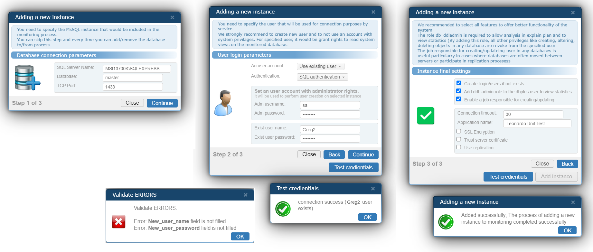

## Modern Modal Windows

I present the 'Modern Modal Windows' class for a web browser. Written in JavaScript, html, css. There may be several of them and they may create a multi-window application in the browser. They are slidable, with variable size, shadows, protrusions - they create pleasant graphics;

Example my ModalWindows:

Please wait a moment for the image below: the gif may take longer to load
.

.

.

